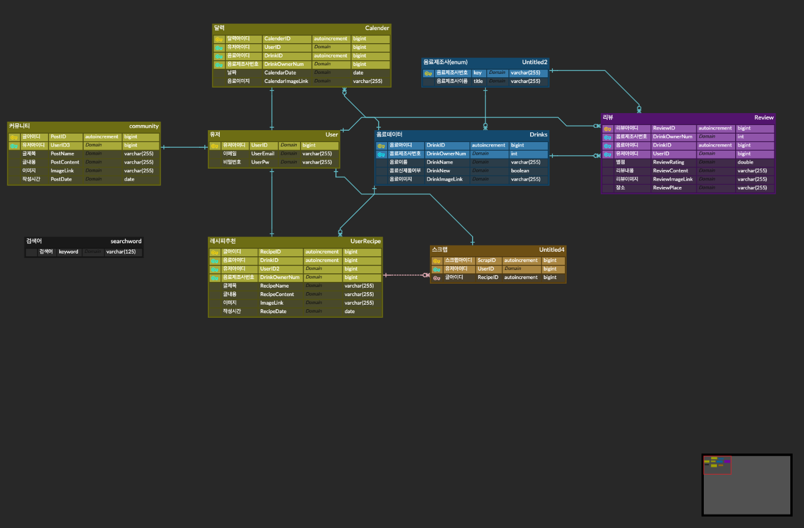

# 음료 기록, 추천 서비스 Bever

>사용기술

* Spring FrameWork 사용(Java)
* MSA 구조 적용(진행중)

>코드 구조

* Controller
    * 캘린더(Calender)
    * 커뮤니티(글)(CommunityController)
    * 크롤러 (CrawlingController)
    * 레시피(글)(RecipeController)
    * 리뷰(글)(ReviewController)
    * 스크랩(ScrapController)
    * 유저(UserController)

* Domain
  